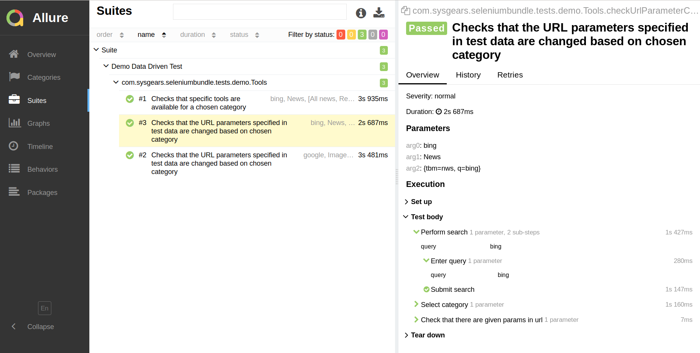

# Data Driven Testing with Selenium Automation Bundle

Selenium Automation Bundle embraces the [Data Driven Testing] (DDT) pattern to help you manage large sets of test data 
that you use in your tests. With YAML files and our `data` module, you get a simple way to retrieve test data in your 
data-driven tests.

In this simple guide, you're going to run a demo data-driven test to just get your feet wet.

## Selenium Automation Bundle Mechanism for Data Driven Testing

Our mechanism for writing data-driven tests is built around the TestNG the [Data Providers]. Armed with the power of
Data Providers and our custom classes and annotations, you can easily retrieve data from YAML files in your tests.

Here are the classes and annotations that we've developed for DDT:

* `DataLoader`, the class that loads test data from YAML files
* `DataMapper`, the class that transforms loaded data to a `Map` or `List`
* `Locator`, `@Find`, and `@Query`, the annotations for building data queries

We'll have a closer look at these components of the `data` module in a later section. For now, you can run your first
data-driven test with Selenium Automation Bundle.

## Running a Data Driven Test

Selenium Automation Bundle provides a demo data-driven test `Tools`. To run this test, first replace the default TestNG 
configuration with the configuration below (look for `testng.xml` file in `src/test/resources`):

```xml
<!DOCTYPE suite SYSTEM "http://testng.org/testng-1.0.dtd" >

<suite name="Suite">
    <test name="Demo Data Driven Test">
        <classes>
            <class name="com.sysgears.seleniumbundle.tests.demo.Tools"/>
        </classes>
    </test>
</suite>
```

Now you can run the test using the following command:

```bash
./gradlew clean test allureServe
```

**NOTE**: If you see the error `Cannot find allure commandline` after the test was run, you need to download Allure and
generate the report with the command `./gradlew downloadAllure allureServe`. Learn more about report generation in
[Reporting].

Once the test is completed, your default browser will open the report:

<p align="center">
  
</p>

The demo example that you've just run is based on the following files:

* `src/test/groovy/.../tests/demo/Tools.groovy`, the test class
* `src/test/resources/data/google/test_data.yml`, the test data

In the following section, we'll briefly review how the demo data-driven test works. If you need a detailed explanation,
you can follow to [Data Driven Testing in Action].

## Demo Test Class for Data Driven Testing

The data-driven test `Tools`, shown below, demonstrates the use of DDT in Selenium Automation Bundle:

```groovy
package com.sysgears.seleniumbundle.tests.demo

import com.sysgears.seleniumbundle.common.FunctionalTest
import com.sysgears.seleniumbundle.core.data.DataLoader
import com.sysgears.seleniumbundle.core.data.annotations.Locator
import com.sysgears.seleniumbundle.pagemodel.GooglePage
import com.sysgears.seleniumbundle.pagemodel.ResultsPage

import org.testng.annotations.BeforeMethod
import org.testng.annotations.DataProvider
import org.testng.annotations.Test

import java.lang.reflect.Method

class Tools extends FunctionalTest {
    /**
     * Declare the page object.
     */
    protected GooglePage googlePage

    /**
     * Declare and initialize DATAFILE.
     */
    private final static String DATAFILE = "src/test/resources/data/google/test_data.yml"

    /**
     * Instantiate the page object before each test method.
     */
    @BeforeMethod
    void openApplication() {
        googlePage = new GooglePage().open().waitForPageToLoadElements().selectLanguage()
    }
    
    /**
     * Create a Data Provider method that will get data from YAML and map them to test methods.
     *
     * Use the TestNG Data Provider mechanism - the @DataProvider annotation, and return
     * Object[][], a two-dimensional array.
     *
     * Pass the test method to Data Provider method as argument Method m.
     *
     * In the Data Provider method body use mapper - a DataMapper instance - to map data
     * from a Yaml file. The DataMapper instance is automatically created.
     *
     * Retrieve data using mapper.map() method. Use DataLoader static method readListFromYml()
     * to transform data to List.
     */
    @DataProvider(name = 'getTestData')
    Object[][] getTestData(Method m) {
        mapper.map(DataLoader.readListFromYml(DATAFILE), m)
    }

    @Test(dataProvider = "getTestData",
          description = "Checks that url parameters specified in test data are changed based on chosen category")
    void checkUrlParameterChanges(
            @Locator("query") String query,
            @Locator("category") String category,
            @Locator("result.url.params") Map params) {

        googlePage
                .searchFor(query)

        new ResultsPage()
                .waitForPageToLoadElements() // waits until the page is fully loaded
                .selectCategory(category) // selects the category by clicking a link
                .validateUrlParams(params) // compares URL params to data from test_data.yml
    }
    // other code is omitted
}
```

Let's review how the class works:

1. The class declares and initializes the `test_data.yml` file to be used in test.

2. The class creates `getTestData()`, which is a TestNG Data Provider. `getTestData()` uses `DataLoader` to first read
test data from a file, and then to map test data using `mapper`, an instance of `DataMapper`.

> `mapper` is available through the `BaseTest` test class. `BaseTest` is extended by `FunctionalTest` that your actual
> test class should inherit.

3. The test method `checkUrlParameterChanges()` is annotated with `@Test` that sets `dataProvider` to `getTestData()`.

4. `checkUrlParameterChanges()` accepts three parameters &ndash; `query`, `category`, and `params`, each of which is
with annotated `@Locator()`, which contains the string queries for necessary data from the YAML file.

In other words, your YAML file must have a list that starts with the string `query`, which points to the actual data
you'll need in your test. This data through `@Locator` will be mapped to the parameter `String query` in
`checkUrlParameterChanges()`. Eventually, you can use this `query` parameter in your test.

In order to complete the overall picture, it's worth looking at the demo YAML file
`src/test/resources/data/google/test_data.yml`. Here's its excerpt:

```yml
- query: google
  category: Images
  result:
    url:
      params:
        tbm: isch
        q: google
```

Notice that `@Locator(`query`)` grabs the `query` request in YAML file and maps the `google` value to the `query`
parameter in the test class.

With all that information, the test works like this when executed:

1. A `GooglePage` instance is created. The method `searchFor()` is called with the parameter `query`, which references
the value requested by `@Locator('query')`.

2. `query` in annotation points to `google` and is retrieved by the Data Provider `getTestData()` from `test_data.yml`.
(Yes, our demo test searches for `google` using Google).

3. Once the request `google` is sent, the browser shows the search results page. Therefore, the test instantiates the 
`ResultsPage` page object.

4. The `resultsPage` instance runs the actual test.

    * It first waits until the page is fully loaded using `waitForPageToLoadElements()`.
    * Then, `selectCategory()` is called with the `category` parameter, which stores the value retrieved by
      `@Locator('category')`. The value for `category` is `Images`, as you can see in `test_data.yml`. In other words,
      once the results page for the request `google` is loaded, Selenide clicks on the link `Images` to open the images
      results for the `google` search request.
    * Finally, the `validateUrlParams()` is called with the `params` value from `test_data.yml`.

To explain better the last step in the fourth point, we should take a look at the URL for the results page:

google.com/search?**_q=google_**&source=lnms&**_tbm=isch_**&sa=X&ved=0ahUKEwiekPniiP_dAhXBlYsKHau7CeIQ_AUIDigB&biw=1174&bih=588

You can see the parameters in the URL such as `q` and `tbm`. The `validateUrlParams()` simply compares the parameters'
values taken from the URL to the values stored in `test_data.yml` file. If you get back to `test_data.yml`, you'll 
see the properties `result.url.params.q` and `result.url.params.tbm` store the values `google` and `isch` respectively.

Because the values for the parameters `q` and `tbm` are identical in the URL and `test_data.yml`, this data driven test 
will pass successfully.

___

In a real application, when your application uses complex objects, it's easy to mimic the object structure in a YAML 
file and retrieve various object properties in your tests thanks to the bundle's `data` module.

We've only scratched the surface of the Data Driven Testing approach in Selenium Automation Bundle. If you want to know
more, follow to [Data Driven Testing in Action].

[data driven testing]: https://en.wikipedia.org/wiki/Data-driven_testing
[data providers]: http://testng.org/doc/documentation-main.html#parameters-dataproviders
[reporting]: https://github.com/sysgears/selenium-automation-bundle/blob/docs/docs/fundamentals/Reporting.md
[data driven testing in action]: https://github.com/sysgears/selenium-automation-bundle/blob/docs/docs/fundamentals/Data%20Driven%20Testing/Data%20Driven%20Testing%20in%20Action.md
[creating test classes]: https://github.com/sysgears/selenium-automation-bundle/blob/docs/docs/advanced/Writing%20Tests.md#general-considerations-before-writing-tests