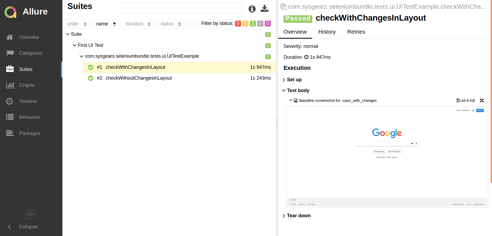

# Introduction to User Interface (Layout) Testing with Selenium Automation Bundle

Selenium Automation Bundle provides a simple way to test a web application's user interface. You only need to take
screenshots of the initial layout after it was tested (read: you need to verify that the basic application's layouts
looks fine and functions correctly). After that, when the UI changes, you need to run the same UI tests again.

When running your UI tests after the layouts were modified, the bundle will take new screenshots of the application's
layouts, compare the old and new screenshots, create new images with highlighted differences between them, and attach
them to the report. Finally, your task is to generate a report and visually validate what has changed, and report bugs
if any.

You can also consult the [detailed guide] for more details about testing the user interface. In this short guide,
you'll run the demo UI test to get the feeling how it works with the bundle.

## Demo User Interface Test

> You may want to first read the [introduction] to writing tests or the [general guide].

> To learn more about creating page objects and test classes, consult the [page object] and [test classes] sections in
our general guide on testing.

You'll run your first UI test. The demo files for UI testing are the following:

* `UITestExample`, a test class located in `src/test/.../tests/ui/`;
* `GooglePage`, a page object located in `src/main/.../seleniumbundle/pagemodel/`.

### Change TestNG Configuration File to Run UI Test

You need to change the settings in the `testng.xml` configuration file to run just the demo UI test. Open the
`src/test/resources/testng.xml` file and replace the default configuration with the one below:

```xml
<!DOCTYPE suite SYSTEM "http://testng.org/testng-1.0.dtd" >

<suite name="Suite">
    <test name="First UI Test">
        <classes>
            <class name="com.sysgears.seleniumbundle.tests.ui.UITestExample"/>
        </classes>
    </test>
</suite>
```

### Create Baseline Screenshots

When testing the user interface with Selenium Automation Bundle, you need to create the baseline screenshots that will
be used for comparison:

```bash
./gradlew -Dtest.baselineMode=true
```

You can learn more about `baselineMode` in the [Baseline Mode] section.

The bundle will run `UITestExample`. At this point, no comparison is made: in fact, the bundle only takes screenshots of
the current layout of the Google page.

Once the test execution is completed, you can find the screenshots created under the `src/test/resources/uicomparison/your_os/chrome`
directory (instead of `your_os/`, the bundle will create a directory `linux/`, `windows/`, or `mac/` depending on the
operating system you're using).

You can also generate an Allure report to view the screenshots:

```bash
./gradlew allureServe
```

> **NOTE**: If you see any error related to report generation, download Allure and then generate the report with the
command `./gradlew downloadAllure allureServe`. You can learn more about report generation in the [Reports] guide.

An Allure report with the UI tests:

<p align="center">
    
</p>

### Run the UI Test with UI Comparison

After you've created the baseline screenshots, the bundle can take screenshots of the application and compare them to
the baseline screenshots. Just run the UI test with the following command:

```bash
./gradlew
```

In the command line, you'll see that one demo UI test has failed. That's okay as one test in the `UITestExample` class
is _intended_ to fail:

```bash
Starting a Gradle Daemon (subsequent builds will be faster)

> Task :test

Suite > First UI Test > com.sysgears.seleniumbundle.tests.ui.UITestExample.checkWithChangesInLayout FAILED
    java.lang.AssertionError at UITestExample.groovy:42

2 tests completed, 1 failed


FAILURE: Build failed with an exception.

* What went wrong:
Execution failed for task ':test'.
> There were failing tests. See the report at: file:///home/sviatoslav/projects/selenium-automation-bundle/build/reports/tests/test/index.html

* Try:
Run with --stacktrace option to get the stack trace. Run with --info or --debug option to get more log output. Run with --scan to get full insights.

* Get more help at https://help.gradle.org

Deprecated Gradle features were used in this build, making it incompatible with Gradle 5.0.
See https://docs.gradle.org/4.6/userguide/command_line_interface.html#sec:command_line_warnings

BUILD FAILED in 24s
6 actionable tasks: 6 executed
```

You can now generate a report to view the screenshots of the test. Run:

```bash
./gradlew downloadAllure allureServe
```

You default browser will open with the report. You can open the Suites tab and navigate to the test that failed:

<p align="center">
    
</p>

## Conclusions

Selenium Automation Bundle provides great possibilities for testing the user interface (read: the application layouts).
If you want to know more about UI testing with our bundle, consult the [detailed UI testing guide].

[detailed guide]: https://github.com/sysgears/selenium-automation-bundle/blob/docs/docs/fundamentals/UI%20Testing/General%20Concept%20and%20Testing%20Flow.md
[introduction]: https://github.com/sysgears/selenium-automation-bundle/blob/docs/docs/Introduction%20to%20Writing%20Tests.md
[general guide]: https://github.com/sysgears/selenium-automation-bundle/blob/docs/docs/fundamentals/Writing%20Tests.md
[page object]: https://github.com/sysgears/selenium-automation-bundle/blob/docs/docs/fundamentals/Writing%20Tests.md#creating-a-page-object
[test classes]: https://github.com/sysgears/selenium-automation-bundle/blob/docs/docs/fundamentals/Writing%20Tests.md#creating-a-test
[baseline mode]: https://github.com/sysgears/selenium-automation-bundle/blob/docs/docs/fundamentals/UI%20Testing/Baseline%20Mode.md
[reports]: https://github.com/sysgears/selenium-automation-bundle/blob/docs/docs/fundamentals/Reporting.md
