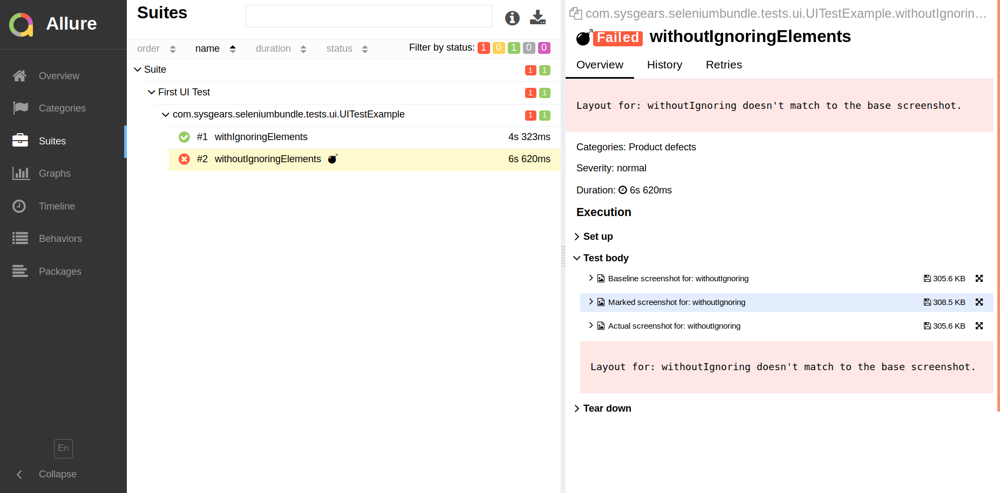

# Introduction to User Interface (Layout) Testing with Selenium Automation Bundle

Selenium Automation Bundle provides a simple way to test applications' user interface. You only need to take screenshots
of the initial layout after it was tested (the basic application layout must look fine and function correctly). After
that, when the UI changes, you need to run the same UI tests again.

When running your UI tests after the layouts were modified, the bundle will take new screenshots of applications'
layouts, find the differences, create new images with highlighted differences, and attach them to the report. Finally,
your task is to generate a report and visually validate what has changed, and report bugs if any.

You can also consult the [detailed guide] for more details about testing the user interface. In this short guide,
you'll go through the basic steps of testing the UI.

## Demo User Interface Test

> You may want to first read the [introduction] or [general guide] to writing tests with Selenium Automation Bundle.

> To learn more about creating page objects and test classes, consult the [page object] and [test classes] sections in
our general guide to testing.

You'll run the demo UI test. The demo files for UI testing are the following:

* `UITestExample`, a test class
* `ShopidaiPage`, a page object

### Create Baseline Screenshots

When testing the UI, you need to first create the baseline screenshots that will be used for comparison:

```bash
./gradlew -Dtest.baselineMode=true
```

You can learn more about `baselineMode` in the [Baseline Mode] section.

The bundle will run the tests (by default, Gradle runs the `clean` and `test` tasks). Once the test execution is
completed, you can find the screenshots in the `src/test/resources/uicomparison/your_os/chrome` directory (instead of
`your_os`, the bundle will use `linux`, `windows`, or `mac` depending on the operating system you're using).

### Change TestNG Configuration File to Run UI Test

You need to change the settings in the `testng.xml` configuration file to run just the UI test. Open the
`src/test/resources/testng.xml` file and change the package you're going to run.

Just replace `demo` with `ui`. You may also want to rename the test to something like `First UI Test`:

```xml
<!DOCTYPE suite SYSTEM "http://testng.org/testng-1.0.dtd" >

<suite name="Suite">
    <test name="First UI Test">
        <packages>
            <package name="com.sysgears.seleniumbundle.tests.ui.*"/>
        </packages>
    </test>
</suite>
```

### Run the UI Test

Once you change the `testng.xml`, you can run the test with the following command:

```bash
./gradlew
```

In the command line, you'll see that the demo UI test failed. That's okay as one test in the `UITestExample` class is
intended to fail:

```bash
Starting a Gradle Daemon (subsequent builds will be faster)

> Task :test

Suite > First UI Test > com.sysgears.seleniumbundle.tests.ui.UITestExample.withoutIgnoringElements FAILED
    java.lang.AssertionError at UITestExample.groovy:22

Suite > First UI Test > com.sysgears.seleniumbundle.tests.ui.UITestExample.withoutIgnoringElements FAILED
    java.lang.AssertionError at UITestExample.groovy:22

4 tests completed, 2 failed


FAILURE: Build failed with an exception.

* What went wrong:
Execution failed for task ':test'.
> There were failing tests. See the report at: file:///home/sviatoslav/projects/selenium-automation-bundle/build/reports/tests/test/index.html

* Try:
Run with --stacktrace option to get the stack trace. Run with --info or --debug option to get more log output. Run with --scan to get full insights.

* Get more help at https://help.gradle.org

Deprecated Gradle features were used in this build, making it incompatible with Gradle 5.0.
See https://docs.gradle.org/4.6/userguide/command_line_interface.html#sec:command_line_warnings

BUILD FAILED in 45s
6 actionable tasks: 6 executed
```

You can now generate a report to view the screenshots of the test. Run:

```bash
./gradlew allureServe
```

You default browser will open with the report. You can open the Suites tab and navigate to the test that failed:

<p align="center">
    
</p>

> You can learn more about report generation in the [Reports] guide.

## Conclusions

Selenium Automation Bundle provides great possibilities for testing the user interface (read: the application layouts).
If you want to know more about UI testing with our bundle, consult the [detailed UI testing guide].

[detailed UI testing guide]: https://github.com/sysgears/selenium-automation-bundle/blob/docs/docs/fundamentals/General%20Concept%20and%20Testing%20Flow.md
[introduction]: https://github.com/sysgears/selenium-automation-bundle/blob/docs/docs/Introduction%20to%20Writing%20Tests.md
[general guide]: https://github.com/sysgears/selenium-automation-bundle/blob/docs/docs/fundamentals/Writing%20Tests.md
[page object]: https://github.com/sysgears/selenium-automation-bundle/blob/docs/docs/fundamentals/Writing%20Tests.md#creating-a-page-object
[test classes]: https://github.com/sysgears/selenium-automation-bundle/blob/docs/docs/fundamentals/Writing%20Tests.md#creating-a-test
[baseline mode]: https://github.com/sysgears/selenium-automation-bundle/blob/docs/docs/fundamentals/UI%20Testing/Baseline%20Mode.md
[reports]: https://github.com/sysgears/selenium-automation-bundle/blob/docs/docs/fundamentals/Reporting.md