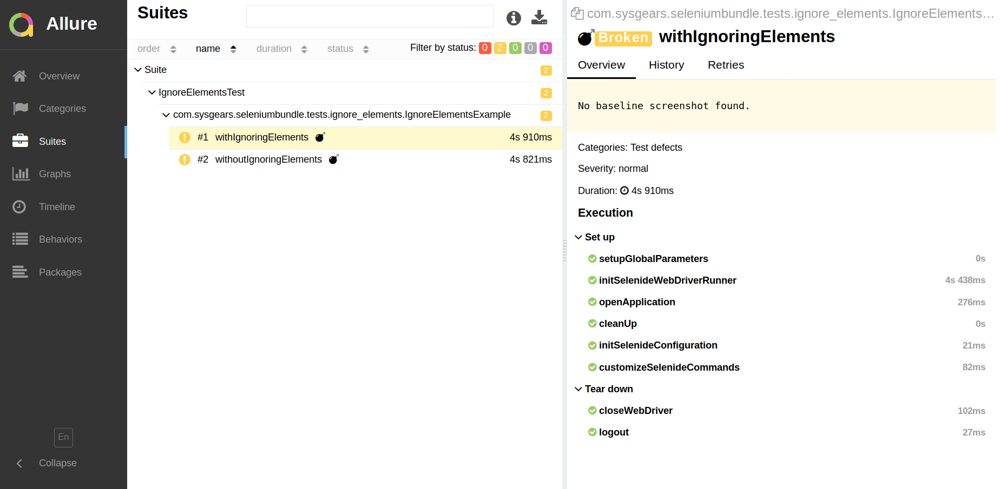

# Creating Baseline Screenshots

When using Selenium Automation Bundle for user interface (UI) testing, you'll be creating baseline screenshots of the
application layouts. In this section, we'll discuss various aspects of creating the baseline screenshots for comparison.

## Baseline Mode and Baseline Screenshots

The _baseline mode_ is a test execution mode when the bundle takes _baseline screenshots_ of the application pages. The
baseline screenshots are taken for the _initial_ application layouts. It's important to understand that the bundle does
**not** run UI tests for comparison in the baseline mode.

When running your UI tests for comparison, Selenium Automation Bundle uses the baseline screenshots as a reference and
compares them with the screenshots of the _current_ application layouts (which were modified) to help you find bugs.

The baseline screenshots are saved under the directory `test/resources/uicomparison/baseline/` that's added
automatically after you run the UI tests in baseline mode.

Note that the bundle will create additional directories inside `baseline/` consistently with the current environment. In
other words, if you run the UI tests under Ubuntu in Chrome, the baseline screenshots will be put into the directory
`baseline/linux/chrome/`.

If you want to change the directory for baseline screenshots, update the respective property &ndash; `ui.path.baseline`
&ndash; in the `ApplicationProperties.groovy` file (which is located in the `src/main/resources/config/` directory):

```groovy
// ui tests configuration
ui {
    path {
        baseline = "src/test/resources/uicomparison/baseline" // Change the path for baseline screenshots if necessary
        actual = "build/reports/tests/uicomparison/actual" // new screenshots
        difference = "build/reports/tests/uicomparison/difference" // diff images
    }
}
```

## General Considerations of Running the UI Tests in Baseline Mode

Here are several considerations that you should take into account when creating the baseline screenshots:

* The baseline screenshots must be taken for a tested initial layout with no bugs. We recommend you to manually test
your application's user interface before creating the baseline screenshots.
* You must take different baseline screenshots for the different environments (the OS platforms and browsers that will
be supported by your application).
* You need to call the `compareLayout()` method on the page objects in your UI test classes so that the bundle knows
when to take the screenshots.
* Avoid running the UI tests in baseline mode more than once.
* If new application pages were created, run the UI tests in baseline mode _only for the new pages_. You can set the
necessary test classes for new pages in `testng.xml` or your TestNG configuration file.

We advise against running all the UI test in baseline mode each time you execute UI tests because the bundle will
replace the previous baseline screenshots. Therefore, you may unintentionally replace the baseline screenshots that have
the incorrect or broken layouts, and in the next runs, the bundle will compare the application screens with those faulty
layouts.

Also note that if you don't create the baseline screenshots before running UI tests for comparison, the tests that run
`compareLayout()` will fail. See the screenshot below:

<p align="center">
    
</p>

## Running the UI Tests in Baseline Mode

You can set the baseline mode &ndash; the `test.baselineMode` property &ndash; when running the UI tests via the command
line. By default, this property is set to `false`.

Run the command below to set `test.baselineMode` to true:

```bash
./gradlew -Dtest.baselineMode=true
```
