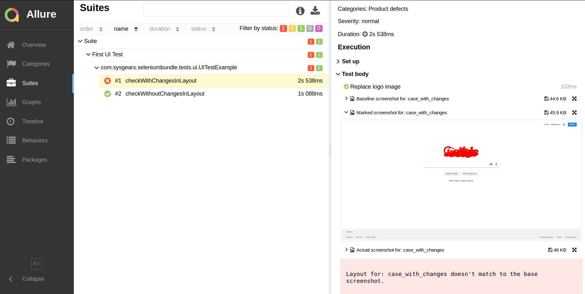

# Detailed Guide on UI Testing with Selenium Automation Bundle

This guide provides an overview of how works the demo UI test that you've run in the [introduction to UI testing].

We'll have a look at the `UITestExample` test class, which tests the user interface of the Google search page. The test
class' implementation is located in the `src/test/groovy/.../tests/ui/` directory.

## Demo UI Test Class

`UITestExample` is one the two demo test classes that demonstrate how user interface testing is done with Selenium
Automation Bundle. `UITestExample` is a very simple UI test that does just one simple thing &ndash; it replaces
the Google logo.

In your real UI tests, however, the changes to the user interface can be much more complex. You can change the state of
the web page however you need and take screenshots of each state for future comparison.

### General Considerations for Writing UI Tests

There aren't many aspects you need to consider when creating tests for the user interface. Basically, you can follow
just these two rules:

* Your UI test class should extend `UITest`, which is a base test class for UI tests.
* Your page object should implement the `UIComparison` trait.

> (Traits are a feature of Groovy; you may want to consult the documentation for [Groovy traits]).

Through `UITest`, your concrete UI test classes can use the mechanism of [soft assertions]. Additionally, UI test
classes also will get all the basic configurations for the environment as it's done in `BaseTest`*. The class hierarchy
is simple: `yourConcreteUITestClass` inherits `UITest`, which inherits `BaseTest`. Both `UITest` and `BaseTest` are
located in `src/test/groovy/.../common/`.

The `UIComparison` trait (intended to be used by your page objects) contains the method `compareLayout()` that you'll
need to call in the test class to tell the bundle at what moment it needs to take a screenshot of the layout.

### UITestExample

Here's the implementation of the `UITestExample` class. As you can see, this test class will test the Google search
page.

```groovy
package com.sysgears.seleniumbundle.tests.ui

import com.sysgears.seleniumbundle.common.UITest
import com.sysgears.seleniumbundle.pagemodel.GooglePage
import org.testng.annotations.BeforeMethod
import org.testng.annotations.Test

class UITestExample extends UITest {

    private GooglePage googlePage

    @BeforeMethod
    void openApplication() {
        googlePage = new GooglePage()
                .setEnvironment(this)
                .open()
                .waitForPageToLoadElements()

        /** setIgnoredElements() is necessary to remove instability related to cursor blinking
         *  and shadow changes under the Google query field.
         */
                .setIgnoredElements(["#tsf"])
    }

    /**
     * Checks the layout of the Google search page that wasn't modified.
     */
    @Test
    void checkWithoutChangesInLayout() {
        googlePage.compareLayout("successful_case")
    }

    /**
     * Checks the layout of the Google search page that was modified.
     */
    @Test
    void checkWithChangesInLayout() {

        // the block below changes the default Google logo to custom one if we don't run the tests in the baseline mode
        if (!conf.baselineMode) {
            googlePage.replaceLogo()
        }

        googlePage.compareLayout("case_with_changes")
    }
}
```

The `UITestExample` class follows the recommendation that we discussed earlier: it extends `UITest`.

Let's now review the test methods.

#### openApplication

The `openApplication()` method is run before each test method, and it creates and configures a new instance of
`GooglePage` to prepare it for testing:

```groovy
@BeforeMethod
void openApplication() {
    googlePage = new GooglePage()
            .setEnvironment(this)
            .open()
            .waitForPageToLoadElements()

    /** setIgnoredElements() is necessary to remove instability related to cursor blinking
     *  and shadow changes under the Google query field.
     */
            .setIgnoredElements(["#tsf"])
}
```

As you may have noticed from the method's code, the `setIgnoredElements()` method is called last in chain.

The `setIgnoredElements()` allows you to [exclude various HTML elements] from comparison. When testing the UI of the
Google search page, we need to ignore the block that contains the Google search input to ensure that the shadow under
the input field doesn't influence the test results. (As the search field is focused or loses focus, the shadow under the
field changes and can break the test when you don't test it.)

#### checkWithoutChangesInLayout

As the name of the method suggests, it'll test the Google search page without changing the layout. This test won't fail
as it doesn't change the layout anyhow:

```groovy
/**
 * Checks the layout of the Google search page that wasn't modified.
 */
@Test
void checkWithoutChangesInLayout() {
    googlePage.compareLayout("successful_case")
}
```

#### checkWithChangesInLayout

The `checkWithChangesInLayout()` method is the key method in the `UITestExample` because it changes the layout:

```groovy
/**
 * Checks the layout of the Google search page that was modified.
 */
@Test
void checkWithChangesInLayout() {

    // the block below changes the Google logo to the custom logo if the test does not run in baseline mode
    if (!conf.baselineMode) {
        googlePage.replaceLogo()
    }

    googlePage.compareLayout("case_with_changes")
}
```

The methods works this way:

* It checks if you run the UI tests in [baseline mode].

If the baseline mode is on (you set it to `true` when running the tests), no changes to the layout is made, and the test
will simply take a screenshot of the default Google search page. In baseline mode, `checkWithChangesInLayout()` works
the same as `checkWithoutChangesInLayout()`.

* If the baseline mode is off (it's `false` by default), the method replaces the logo using the `replaceLogo()` method
on the instance of `GooglePage` (which contains the implementation of `replaceLogo()`).

Therefore, if you run `UITestExample` in baseline mode, then no comparison will be made, and the bundle will only take
two baseline screenshots (the `compareLayout()` method is called twice). But, if you run the UI tests without baseline
mode, the logo will be replaced in `checkWithChangesInLayout()`, and the bundle will take an _actual_ screenshot of the
layout with the new logo.

Then, the bundle will use the [aShot] library to compare the actual and baseline screenshots. And because there are the
logos are different, this test will fail, and you'll see three attached screenshots in the report:

<p align=center>
    
</p>

[introduction to ui testing]: https://github.com/sysgears/selenium-automation-bundle/blob/docs/docs/Introduction%20to%20UI%20Testing.md
[soft assertions]: https://github.com/sysgears/selenium-automation-bundle/blob/docs/docs/fundamentals/UI%20Testing/Soft%20Assertions.md
[groovy traits]: http://docs.groovy-lang.org/next/html/documentation/core-traits.html
[exclude various HTML elements]: https://github.com/sysgears/selenium-automation-bundle/blob/docs/docs/fundamentals/UI%20Testing/Ignoring%20Elements%20in%20UI%20Tests.md
[baseline mode]: https://github.com/sysgears/selenium-automation-bundle/blob/docs/docs/fundamentals/UI%20Testing/Baseline%20Mode.md
[ashot]: https://github.com/sysgears/selenium-automation-bundle/blob/docs/docs/fundamentals/UI%20Testing/UI%20Comparison%20Module.md#ashotservice